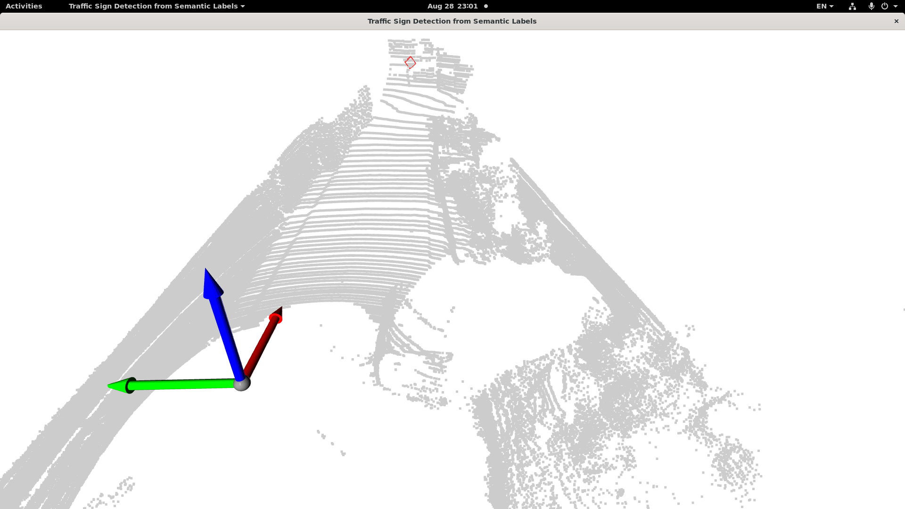

# LiDAR-Camera based 3D Object Detection for Traffic Sign

본 프로젝트는 자율주행 환경에서 LiDAR-Camera 센서 융합을 통해 교통 표지판(traffic sign) 객체를 3D로 검출하는 것을 목표로 하며, SemanticKITTI 데이터셋, 3D Semantic Segmentation 모델, 바운딩 박스 생성 및 시각화 코드를 활용한 실험 및 분석을 포함합니다.

## 목차
- 프로젝트 개요
- 아키텍처 다이어그램
- 개발 환경 및 의존성
- 프로젝트 실행 방법
- 세부 구현 내용
- 개선 방안

## 프로젝트 개요
과제의 목표는 LiDAR 및 LiDAR-Camera 센서 데이터를 활용하여 SemanticKITTI 데이터셋 내의 '교통 표지판(Traffic Sign)' 객체를 3D로 검출하는 것입니다.

과제에서 제시된 세부 문제들을 해결하기 위해 다음과 같이 두 가지 접근 방식을 사용했습니다.
- 세부문제 1(LiDAR Only)   
LiDAR 포인트 클라우드만을 사용하여 객체를 탐지하기 위해 LSK3DNet 모델을 활용했습니다.

- 세부문제 2(LiDAR-Camera Fusion)   
LiDAR와 Camera 데이터를 함께 사용하기 위해 2DPASS 모델을 활용했습니다.

본 프로젝트에서는 사전 학습된(pre-trained) 모델을 파인튜닝이나 재학습 없이 그대로 사용했으며, Semantic Segmentation 결과를 기반으로 DBSCAN 클러스터링을 적용하여 개별 객체의 Bounding Box를 생성하는 후처리 과정에 집중했습니다.

## 아키텍처 다이어그램
전체 시스템은 데이터 전처리 &rightarrow; 3D Semantic Segmentation &rightarrow; Bounding Box 생성 및 시각화의 3단계로 구성됩니다.

```
[SemanticKITTI 데이터셋]
       |
       ▼
[데이터 로더 및 전처리]
       |
       +--------------------+--------------------------+
       | (Problem 1: LiDAR) | (Problem 2: LiDAR-Camera)|
       ▼                                               ▼
[LSK3DNet 모델]                                    [2DPASS 모델]
       |                                               |
       ▼                                               ▼
[Segmentation 결과 (Point Cloud)]
       |                                               |
       ▼                                               ▼
[draw_bbox.py]
(Traffic Sign 클래스 필터링 -> DBSCAN 클러스터링 -> 개별 Bounding Box 생성)
       |
       ▼
[3D Bounding Box 시각화]
(Open3D를 사용하여 원본 포인트 클라우드 위에 시각화)
```

## 개발 환경 및 의존성
각 세부문제 폴더 내 requirements.yaml 파일을 통해 Anaconda 가상환경을 생성할 수 있습니다.

```shell script
conda env create -f requirements.yaml
```

## 프로젝트 실행 방법
### 데이터셋 준비
- [SemanticKITTI Dataset](https://semantic-kitti.org/dataset.html)와 [Camera data](http://www.cvlibs.net/download.php?file=data_odometry_color.zip)을 다운로드 받아 semantickitti/ 디렉토리 내에 배치합니다.
- 데이터셋 구조는 다음과 같아야 합니다.

```
./semantickitti/
├── 
├── ...
└── dataset/
    ├──sequences
        ├── 00/           
        │   ├── velodyne/	
        |   |	├── 000000.bin
        |   |	├── 000001.bin
        |   |	└── ...
        │   └── labels/ 
        |   |   ├── 000000.label
        |   |   ├── 000001.label
        |   |   └── ...
        |   └── image_2/ 
        |   |   ├── 000000.png
        |   |   ├── 000001.png
        |   |   └── ...
        |   calib.txt
        ├── 08/ # for validation
        ├── 11/ # 11-21 for testing
        └── 21/
	    └── ...
```

### 사전 학습된 모델 가중치 다운로드
- [LSK3DNet](https://github.com/FengZicai/LSK3DNet?tab=readme-ov-file#model-zoo)과 [2DPASS](https://github.com/yanx27/2DPASS?tab=readme-ov-file#model-zoo)의 공식 Github에서 pre-trained 모델 파일을 다운로드합니다.
- 모델별 다운로드한 파일을 아래 경로에 각각 위치시킵니다.
  - subproblem1_lidar_only/LSK3DNet/output_skitti
  - subproblem2_lidar_camera/2DPASS/checkpoints

### 추론 및 시각화 실행
```shell script
# LSK3DNet 추론 실행
# subproblem1_lidar_only/LSK3DNet/output_skitti/sequences 폴더 내 추론 결과 저장
cd <subproblem1_lidar_only/LSK3DNet>
CUDA_VISIBLE_DEVICES=0,1 python test_skitti.py | tee output_skitti/opensource_test.txt

# 2DPASS 추론 실행
# subproblem2_lidar_camera/2DPASS/checkpoints/submit_{year_month_day}/sequences 폴더 내 추론 결과 저장
cd <subproblem2_lidar_camera/2DPASS>
python main.py --config config/2DPASS-semantickitti.yaml --gpu 0 --test --num_vote 12 --checkpoint checkpoints/best_model.ckpt --submit_to_server

# 추론 결과 기반 시각화 실행
cd <root dir of this repo>
python draw_bbox.py --pcd_file <dir for the .bin point cloud file> --label_file <dir for the .label prediction file>
```

## 세부 구현 내용
### 세부문제 1: LiDAR 3D Object Detection
1. 모델 선택: [LSK3DNet](https://github.com/FengZicai/LSK3DNet)
   - 선택 이유:
     - 효율적인 3D 인식   
     LSK3DNet은 큰 커널 크기(Large Sparse Kernel)를 사용하여 희소한(sparse) 3D 포인트 클라우드에서 효과적으로 특징을 추출합니다. 이를 통해 넓은 범위의 컨텍스트 정보를 효율적으로 집계할 수 있어, 도로 위 작은 객체인 교통 표지판을 탐지하는 데 유리하다고 판단했습니다.
    
     - 최신 성능   
     CVPR 2024에 발표된 최신 모델로, SemanticKITTI 데이터셋에서 높은 성능(mIoU)을 보여주었기 때문에 별도의 학습 없이도 좋은 성능을 기대할 수 있었습니다.

2. 구현 내용
   - 모델 추론   
   사전 학습된 LSK3DNet 모델에 포인트 클라우드 데이터를 입력하여 Semantic Segmentation을 수행합니다.

   - Bounding Box 생성(draw_bbox.py):
      -  Segmentation 결과에서 'traffic-sign' 클래스로 예측된 포인트들만 필터링합니다.
      -  필터링된 포인트 그룹에 DBSCAN 클러스터링 알고리즘을 적용하여 개별 교통 표지판 객체 인스턴스를 분리합니다.
      -  분리된 각 클러스터(개별 객체)에 대해 독립적인 3D Bounding Box를 생성합니다. 이를 통해 여러 객체가 인접해 있어도 개별적으로 탐지할 수 있습니다.
    
   - 시각화   
   Open3D 라이브러리를 사용하여 원본 포인트 클라우드와 생성된 개별 Bounding Box들을 함께 3D 공간에 시각화하여 결과를 확인합니다.

3. 결과 분석
   - 결과 분석   
   LSK3DNet은 교통 표지판으로 분류된 포인트들을 비교적 정확하게 예측했습니다. 하지만 포인트 클라우드의 희소성 때문에 멀리 있는 작은 표지판이나 일부가 가려진 표지판은 탐지하지 못하는 경우가 있었습니다.

### 세부문제 2: LiDAR-Camera 3D Object Detection
1. 모델 선택: [2DPASS](https://github.com/yanx27/2DPASS)
   - 선택 이유:
     - 2D-3D 양방향 정보 활용   
     2DPASS는 2D 이미지의 풍부한 시맨틱 정보(색상, 질감 등)를 3D 포인트 클라우드 분할에 활용하고, 반대로 3D의 기하학적 정보를 2D 분할에 활용하는 양방향 정보 활용 구조를 가집니다. 이는 LiDAR만으로는 식별이 어려운 객체를 카메라 정보로 보완할 수 있게 해줍니다.
    
     - 효과적인 Fusion   
     2D 이미지에서 얻은 특징을 3D 포인트에 투영(projection)하고 이를 기반으로 3D Segmentation을 수행하므로, 텍스트 정보가 중요한 교통 표지판 탐지에 매우 효과적일 것이라 판단했습니다.

2. 구현 내용
   - 모델 추론   
   사전 학습된 2DPASS 모델에 포인트 클라우드와 이미지를 함께 입력하여 3D Semantic Segmentation을 수행합니다.

   - Bouding Box 생성 및 시각화   
   LSK3DNet과 동일하게 draw_bbox.py 를 사용합니다. 'traffic-sign'으로 예측된 포인트들을 필터링한 후, DBSCAN 클러스터링을 통해 개별 객체로 분리하고 각 객체에 대한 Bounding Box를 생성하여 시각화합니다.

3. 결과 분석 및 개선 방안
   - 결과 분석   
   2DPASS는 LSK3DNet(LiDAR-only)에 비해 더 안정적으로 교통 표지판을 탐지했습니다. 특히 LiDAR 포인트가 매우 희소한 원거리의 표지판도 이미지의 시맨틱 정보를 활용하여 성공적으로 분할해내는 것을 확인할 수 있었습니다. 이는 Fusion의 효과를 명확히 보여주는 결과입니다.

<p align="center">  
    
    <figcaption align="center">Raw image</figcaption>
    <br>
      
      
</p>

## 개선 방안
- Detection Head 추가   
현재는 Segmentation 결과에 의존하므로, LSK3DNet 및 2DPASS의 Backbone 네트워크 위에 3D Bounding Box Regression을 수행하는 Detection Head를 추가하여 End-to-End 3D Object Detector로 발전시킬 수 있습니다.

- Sequential 정보 활용   
연속된 프레임(sequence) 정보를 활용하여 이전 프레임의 탐지 결과를 현재 프레임에 대한 Prior 정보로 사용하여 탐지의 일관성과 안정성을 높일 수 있습니다.